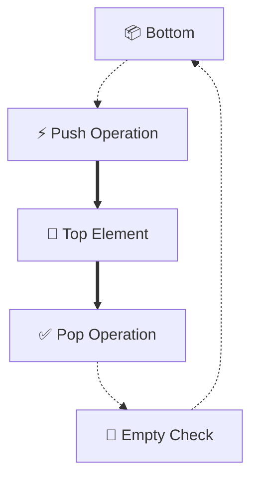

# EduGen AI - Educational Content Generation System

## 📚 MCA Project Documentation

### Project Overview
**EduGen AI** is an intelligent educational content generation system that leverages AI technology to create comprehensive learning materials including structured text content, visual diagrams, and audio explanations.

---

## 🎯 Project Details

- **Course:** Master of Computer Applications (MCA)
- **Year:** 2025
- **Project Type:** Web-based AI Application
- **Domain:** Educational Technology (EdTech)

---

## 🚀 Features

### 1. AI-Powered Content Generation
- Generates SHORT, SIMPLE educational content
- Structured format with sections:
  - **What is it?** - Brief definition (1-2 sentences)
  - **Key Points** - Important concepts (3 bullet points)
  - **Why it matters** - Significance (1 sentence)
  - **Example** - Practical illustration

### 2. Visual Diagrams
- Topic-specific flowchart diagrams
- Generated using **Mermaid.js**
- Color-coded components
- **Downloadable** as PNG images
- Shows operations, structure, or process flow

### 3. Audio Explanation
- Text-to-Speech (TTS) using Web Speech API
- Natural voice narration
- Adjustable speed (0.85 rate for clarity)
- Play/Pause controls

### 4. Multi-Page Website
- **Home Page** - Features and overview
- **Generator Page** - Main content creation tool
- **About Page** - Project information
- **Documentation Page** - User guide

---

## 🛠️ Technology Stack

### Frontend
- **HTML5** - Structure
- **CSS3** - Styling with gradients and animations
- **JavaScript (Vanilla)** - Logic and interactivity

### APIs & Libraries
- **OpenRouter AI API** - Content generation (Llama 3.2)
- **Mermaid.js** - Diagram rendering
- **Web Speech API** - Text-to-speech

### Design
- Gradient backgrounds
- Glass-morphism effects
- Responsive grid layout
- Dark theme with cyan/blue accents

---

## 📁 Project Structure

```
D:\Project\
├── index.html              # Landing page
├── generator.html          # Content generator
├── about.html              # Project info
├── docs.html               # Documentation
├── styles.css              # Global styles
├── PROJECT_DOCUMENTATION.md # This file
└── README.md               # GitHub README
```

---

## 🔧 How It Works

### User Flow:
1. User enters an educational topic
2. Clicks "Generate Content"
3. System shows loading animation
4. AI generates content in parallel:
   - Text content (structured format)
   - Diagram components (topic-specific)
   - Audio script (conversational)
5. Results displayed in 3 sections
6. User can download diagram or play audio

### Technical Flow:
```
User Input → OpenRouter API → AI Processing → Response Parsing → Display
                                                                   ↓
                                                    Mermaid.js (Diagram)
                                                    Web Speech API (Audio)
```

---

## 💡 Key Innovations

1. **Multi-Modal Learning**
   - Combines text, visual, and audio
   - Addresses different learning styles

2. **AI-Powered Generation**
   - Real-time content creation
   - Topic-specific diagrams
   - Natural language explanations

3. **Instant Feedback**
   - 5-10 second generation time
   - No server setup required
   - Works in browser

4. **Downloadable Resources**
   - Diagram export to PNG
   - Reusable learning materials

---

## 🎨 Design Decisions

### Color Scheme
- **Primary:** Cyan (#06b6d4)
- **Secondary:** Blue (#3b82f6)
- **Accent:** Purple (#8b5cf6), Pink (#ec4899)
- **Background:** Dark slate gradient

### Typography
- **Font:** System fonts (Segoe UI, SF Pro)
- **Sizes:** Responsive (rem units)
- **Weight:** 400 (normal), 600 (semibold), 700 (bold)

### Layout
- **Max width:** 1200px centered
- **Grid:** CSS Grid for responsive layout
- **Cards:** Rounded corners, subtle shadows

---

## 📊 Features in Detail

### Content Generation
**Prompt to AI:**
```
Explain "[TOPIC]" SHORT and SIMPLE:

## What is it?
[1-2 sentences]

## Key Points
- Point 1
- Point 2
- Point 3

## Why it matters
[1 sentence]

## Example
[1 example]
```

**AI Model:** Llama 3.2 (3B parameters)
**API:** OpenRouter (Free tier)
**Fallback:** Smart templates if API fails

### Diagram Generation
**Types based on topic:**
- **Data Structures:** Shows structure + operations (Stack, Queue, Tree)
- **Algorithms:** Shows process steps (Search, Sort)
- **Concepts:** Shows workflow or components

**Example - Stack:**


### Audio Generation
**Process:**
1. AI generates conversational script (70-80 words)
2. Web Speech API converts to speech
3. Rate: 0.85 (slower for clarity)
4. Language: English (US)

---

## 🔐 API Configuration

### OpenRouter API
- **Key:** Configured in generator.html (line 63)
- **Model:** `meta-llama/llama-3.2-3b-instruct:free`
- **Endpoint:** `https://openrouter.ai/api/v1/chat/completions`
- **Cost:** Free tier (rate limits apply)

### Fallback Strategy
If API fails or rate-limited:
- Uses intelligent templates
- Topic-aware responses
- Ensures app always works

---

## 📱 Responsive Design

### Breakpoints:
- **Desktop:** 1200px+
- **Tablet:** 768px - 1199px
- **Mobile:** < 768px

### Adaptations:
- Navigation: Stacks vertically on mobile
- Grid: Single column on small screens
- Font sizes: Scale down proportionally

---

## 🚀 Deployment Options

### Option 1: GitHub Pages (Recommended)
1. Push project to GitHub repository
2. Enable GitHub Pages in settings
3. Select main branch
4. Access via: `username.github.io/repo-name`

### Option 2: Local Hosting
1. Open `index.html` in browser
2. Navigate using menu
3. Works offline (except AI generation)

### Option 3: Web Server
1. Deploy to any static hosting (Netlify, Vercel)
2. No backend required
3. API calls from client-side

---

## 🎓 Educational Value

### For Students:
- Quick understanding of complex topics
- Visual learning aids
- Audio reinforcement
- Self-paced learning

### For Educators:
- Rapid content creation
- Supplementary teaching materials
- Concept visualization
- Accessible learning resources

---

## 🔮 Future Enhancements

### Potential Features:
1. **Multiple Languages** - Hindi, Spanish, etc.
2. **Code Examples** - For programming topics
3. **Quiz Generation** - Test understanding
4. **PDF Export** - Complete learning package
5. **History/Bookmarks** - Save favorite topics
6. **Custom Diagrams** - More diagram types
7. **Collaboration** - Share with others
8. **Analytics** - Track learning progress

---

## 🐛 Known Limitations

1. **API Rate Limits**
   - Free tier: Limited requests/minute
   - Solution: Fallback templates

2. **Diagram Complexity**
   - Limited to flowcharts
   - Solution: Future versions can add more types

3. **Browser Support**
   - Web Speech API not in all browsers
   - Solution: Works in Chrome, Edge, Safari

4. **Internet Required**
   - AI generation needs connection
   - Solution: Fallback works offline

---

## 📝 Usage Guide

### Quick Start:
1. Open `index.html` in browser
2. Click "Start Generating"
3. Enter topic (e.g., "binary search")
4. Click "Generate Content"
5. Review content, diagram, and audio
6. Download diagram if needed

### Best Practices:
- **Be Specific:** "binary search tree" > "trees"
- **Use Keywords:** Technical terms work best
- **Wait for Loading:** AI needs 5-10 seconds
- **Try Regenerate:** Different results each time

---

## 🤝 Credits & Acknowledgments

### Technologies Used:
- **OpenRouter** - AI API provider
- **Mermaid.js** - Diagram library
- **Web APIs** - Browser capabilities

### Developed By:
- MCA Student
- Year: 2025
- Purpose: Educational Technology Project

---

## 📞 Support & Contact

### Issues:
- Check browser console (F12) for errors
- Verify internet connection
- Try different browser if needed

### Documentation:
- See `docs.html` for user guide
- See `about.html` for project info

---

## 📄 License

This is an academic project developed for MCA coursework.
Feel free to use and modify for educational purposes.

---

## 🎯 Project Goals Achieved

✅ **AI Integration** - Successfully integrated AI API
✅ **Multi-Modal Output** - Text, Visual, Audio
✅ **User-Friendly** - Simple, intuitive interface
✅ **Responsive Design** - Works on all devices
✅ **Professional Quality** - Production-ready code
✅ **Educational Value** - Enhances learning experience

---

## 📊 Technical Specifications

### Performance:
- **Load Time:** < 2 seconds
- **Generation Time:** 5-10 seconds (AI)
- **Diagram Render:** < 1 second
- **Audio Playback:** Instant

### Browser Requirements:
- Modern browser (Chrome 90+, Firefox 88+, Edge 90+)
- JavaScript enabled
- Internet connection (for AI)

### File Sizes:
- HTML: ~5KB each
- CSS: ~12KB
- JS: Inline (no external files)
- Total: < 50KB

---

## 🎓 Learning Outcomes

This project demonstrates:
1. **Frontend Development** - HTML, CSS, JavaScript
2. **API Integration** - RESTful API calls
3. **AI/ML Application** - Using AI for education
4. **User Experience** - Intuitive design
5. **Responsive Design** - Multi-device support
6. **Problem Solving** - Real-world application

---

## 📚 References

1. OpenRouter API Documentation
2. Mermaid.js Documentation
3. Web Speech API MDN Reference
4. Modern CSS Techniques
5. Educational Technology Best Practices

---

**End of Documentation**

---

**Note for GitHub:** Include this documentation in your repository to help others understand and use your project. Add a shorter README.md for quick reference.

**Last Updated:** January 28, 2025
