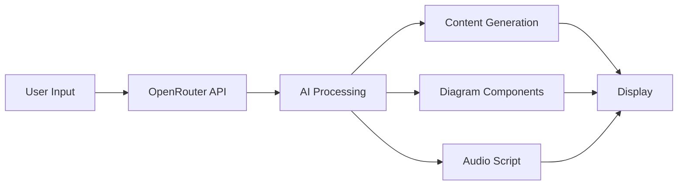

# 🎓 EduGen AI - Educational Content Generator

> An AI-powered educational content generation system that creates structured learning materials with visual diagrams and audio explanations.

[]()
[]()
[]()

## 🌟 Live Demo

[Open Live Demo](https://your-username.github.io/edugen-ai) ← Replace with your GitHub Pages URL

## 📸 Screenshots

### Landing Page
Professional homepage with features overview

### Content Generator
AI-powered content creation with diagrams

### Results Display
Structured content, visual diagram, and audio player

## ✨ Features

- 🤖 **AI-Powered** - Uses Llama 3.2 via OpenRouter API
- 📊 **Visual Diagrams** - Topic-specific flowcharts with Mermaid.js
- 🎧 **Audio Narration** - Text-to-speech explanations
- 📱 **Responsive** - Works on all devices
- ⬇️ **Downloadable** - Export diagrams as PNG
- 🎯 **Topic-Specific** - Smart diagram generation

## 🚀 Quick Start

1. **Clone the repository**
   ```bash
   git clone https://github.com/your-username/edugen-ai.git
   cd edugen-ai
   ```

2. **Open in browser**
   ```bash
   # Simply open index.html in your browser
   # or use a local server
   python -m http.server 8000
   ```

3. **Start generating**
   - Navigate to Generator page
   - Enter any educational topic
   - Click "Generate Content"

## 🛠️ Technology Stack

| Category | Technology |
|----------|-----------|
| Frontend | HTML5, CSS3, JavaScript |
| AI API | OpenRouter (Llama 3.2) |
| Diagrams | Mermaid.js |
| Audio | Web Speech API |
| Hosting | GitHub Pages (Static) |

## 📁 Project Structure

```
edugen-ai/
├── index.html              # Landing page
├── generator.html          # Content generator
├── about.html              # Project information
├── docs.html               # Documentation
├── styles.css              # Global styles
├── PROJECT_DOCUMENTATION.md # Complete docs
└── README.md               # This file
```

## 💡 How It Works



1. User enters educational topic
2. System sends request to OpenRouter API
3. AI generates structured content
4. Mermaid.js renders diagram
5. Web Speech API creates audio
6. Results displayed in 3 sections

## 🎯 Use Cases

- **Students** - Quick topic understanding
- **Educators** - Supplementary teaching materials
- **Self-learners** - Structured learning resources
- **Content Creators** - Educational content templates

## 🔧 Configuration

### API Setup

The project uses OpenRouter API. To use your own key:

1. Get free API key from [OpenRouter](https://openrouter.ai)
2. Open `generator.html`
3. Replace the KEY variable (line 63):
   ```javascript
   const KEY = 'your-api-key-here';
   ```

### Customization

**Colors:** Edit `styles.css` (lines 133-136)
**AI Prompts:** Modify in `generator.html` (lines 85-97)
**Diagram Style:** Update Mermaid config (line 136-149)

## 📊 Features in Detail

### Content Generation
- **Format:** What is it? + Key Points + Why it matters + Example
- **Length:** Short, concise (not lengthy documents)
- **Style:** Simple language for students

### Visual Diagrams
- **Type:** Flowcharts (top-to-bottom)
- **Components:** 4-5 topic-specific elements
- **Colors:** Gradient (cyan → blue → purple → pink)
- **Icons:** Emoji for visual appeal (📦⚡🎯✅🔄)
- **Download:** Export as PNG image

### Audio Explanation
- **Voice:** Browser default (customizable)
- **Speed:** 0.85x (slower for clarity)
- **Length:** 70-80 words
- **Style:** Conversational, teacher-like

## 🌐 Deployment

### GitHub Pages

1. Push project to GitHub:
   ```bash
   git add .
   git commit -m "Initial commit"
   git push origin main
   ```

2. Enable GitHub Pages:
   - Go to repository Settings
   - Navigate to Pages section
   - Select main branch
   - Save

3. Access your site:
   ```
   https://your-username.github.io/repo-name
   ```

### Other Platforms

- **Netlify:** Drag & drop folder
- **Vercel:** Connect GitHub repo
- **Cloudflare Pages:** Deploy via dashboard

## 📝 API Information

**OpenRouter API:**
- Free tier available
- Model: Llama 3.2 (3B)
- Rate limit: Depends on plan
- Fallback: Smart templates if API fails

**No Backend Required:**
- All API calls from client-side
- No server setup needed
- Works with static hosting

## 🎓 Educational Value

This project demonstrates:
- ✅ Frontend development (HTML/CSS/JS)
- ✅ API integration (REST calls)
- ✅ AI/ML application
- ✅ Responsive design
- ✅ User experience (UX)
- ✅ Problem-solving

## 🐛 Known Issues & Solutions

| Issue | Solution |
|-------|----------|
| API rate limit | Uses fallback templates |
| Diagram not rendering | Refresh page, check Mermaid CDN |
| Audio not playing | Check browser compatibility |
| Same diagram each time | AI generates topic-specific components |

## 🔮 Future Enhancements

- [ ] Multiple diagram types (UML, Mind maps)
- [ ] Code examples for programming topics
- [ ] Quiz generation
- [ ] PDF export
- [ ] Multi-language support
- [ ] User accounts & history
- [ ] Sharing functionality

## 📚 Documentation

For complete documentation, see:
- [PROJECT_DOCUMENTATION.md](PROJECT_DOCUMENTATION.md) - Full technical docs
- [docs.html](docs.html) - User guide
- [about.html](about.html) - Project information

## 🤝 Contributing

This is an MCA academic project. Feel free to fork and modify for educational purposes.

## 📄 License

Academic Project - MCA 2025
Free to use and modify for educational purposes.

## 🙏 Acknowledgments

- OpenRouter for AI API
- Mermaid.js for diagram rendering
- Web Speech API for TTS functionality
- MCA curriculum and guidance

## 📞 Contact

**Project:** EduGen AI  
**Type:** MCA Final Project  
**Year:** 2025  
**Domain:** Educational Technology

---

Made with ❤️ for education | MCA Project 2025

## ⭐ Star This Repository

If you found this project helpful, please give it a star!

